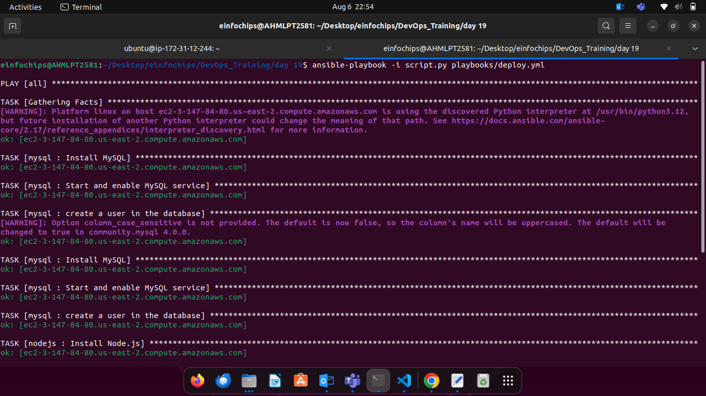
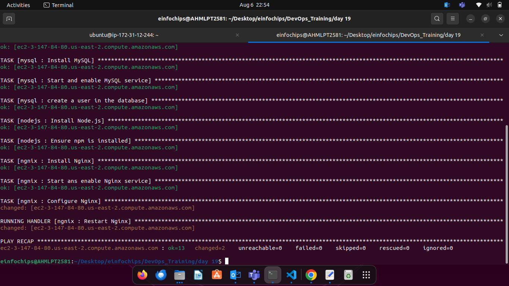

# Project Overview

#### In this capstone project, you will create a comprehensive automated deployment pipeline for a web application on an AWS EC2 instance running Ubuntu using Ansible. You will follow best practices for playbooks and roles, implement version control, document and maintain your code, break down tasks into roles, write reusable and maintainable code, and use dynamic inventory scripts. This project will culminate in a fully functional deployment, demonstrating your mastery of Ansible for infrastructure automation.


### **Milestone 1: Environment Setup**

**Objective**: Configure your development environment and AWS infrastructure.

**Tasks**:

* Launch an AWS EC2 instance running Ubuntu.  
* Install Ansible and Git on your local machine or control node.

**Deliverables**:

* AWS EC2 instance running Ubuntu.  
* Local or remote control node with Ansible and Git installed.
    ```
    sudo apt update
    sudo apt install ansible
    sudo apt install git
    ```

### **Milestone 2: Create Ansible Role Structure**

**Objective**: Organize your Ansible project using best practices for playbooks and roles.

**Tasks**:

* Use Ansible Galaxy to create roles for web server, database, and application deployment.  

```
ansible-galaxy init roles/nodejs
```

```
ansible-galaxy init roles/mysql
```

```
ansible-galaxy init roles/ngnix
```
* Define the directory structure and initialize each role.

**Deliverables**:

* Ansible role directories for webserver, database, and application.

### **Milestone 3: Version Control with Git**

**Objective**: Implement version control for your Ansible project.

**Tasks**:

* Initialize a Git repository in your project directory.  
* Create a `.gitignore` file to exclude unnecessary files.  

```
roles/**/mysql/vars/main.yml
```
* Commit and push initial codebase to a remote repository.

```
git init
git add .
git commit -m "message"
git remote "url of repo"
git push -u origin main 
```
**Deliverables**:

* Git repository with initial Ansible codebase.  
* Remote repository link (e.g., GitHub).

### **Milestone 4: Develop Ansible Roles**

**Objective**: Write Ansible roles for web server, database, and application deployment.

**Tasks**:

* Define tasks, handlers, files, templates, and variables within each role.  
* Ensure each role is modular and reusable.

**Deliverables**:

* nodejs/task/main.yml
```yml
---
- name: Install Node.js 
  apt:
    name: nodejs
    state: present
    update_cache: yes

- name: Ensure npm is installed 
  apt:
    name: npm
    state: present
```

* nodejs/meta/main.yml
```yml
dependencies: 
  - role: mysql
    when: ansible_os_family == "Debian"
```

* mysql/task/main.yml
```yml
---
- name: Install MySQL
  apt:
    update_cache: yes
    name: ['mysql-server','mysql-client','python3-mysqldb','libmysqlclient-dev']
    state: present
  become: yes

- name: Start and enable MySQL service
  service:
    name: mysql
    state: started
    enabled: true
  become: yes
  
- name: create a user in the database
  mysql_user:
    name: "{{ mysql_user }}"
    password: "{{ mysql_password }}"
    priv: '*.*:ALL'
    host: '%'
    state: present
  become: yes
```
* mysql/vars/mian.yml
```yml
---
# vars file for roles/mysql
mysql_user: ****
mysql_password: ********
```

* ngnix/task/main.yml
```yml
---
- name: Install Nginx 
  apt:
    name: nginx
    state: present
  become: yes
 
- name: Start ans enable Nginx service
  service:
    name: nginx
    state: started
    enabled: true
  become: yes
 
- name: Configure Nginx
  template:
    src: index.html.j2
    dest: /var/www/html/index.html
  notify: Restart Nginx
```

* ngnix/meta/main.yml
```yml
dependencies: 
  - role: nodejs
```

* ngnix/templates/index.html.j2
```html
<html>
    <head>
        <title>Day-19</title>
    </head>
    <body>
        <center>
            <h1>Hello from Frontend</h1>
        </center>
    </body>
</html>
```

* ngnix/files/index.html
```html
<html>
    <head>
        <title>Day-19</title>
    </head>
    <body>
        <center>
            <h1>Hello from Frontend</h1>
        </center>
    </body>
</html>
```


### **Milestone 5: Dynamic Inventory Script**

**Objective**: Use dynamic inventory scripts to manage AWS EC2 instances.

**Tasks**:

* Write a Python script that queries AWS to get the list of EC2 instances.  

* script.py
```py
#!/usr/bin/env python3

import json
import boto3

def get_inventory():
    ec2 = boto3.client('ec2', region_name='region')  # Specify your region
    response = ec2.describe_instances(Filters=[{'Name': 'tag:Name', 'Values': ['Name']}])
    
    inventory = {
        'all': {
            'hosts': [],
            'vars': {}
        },
        '_meta': {
            'hostvars': {}
        }
    }
    
    ssh_key_file = '/path/to/file/ansible-worker.pem'  # Path to your SSH private key file
    ssh_user = 'ubuntu'  # SSH username
    
    for reservation in response['Reservations']:
        for instance in reservation['Instances']:
            public_dns = instance.get('PublicDnsName', instance['InstanceId'])
            inventory['all']['hosts'].append(public_dns)
            inventory['_meta']['hostvars'][public_dns] = {
                'ansible_host': instance.get('PublicIpAddress', instance['InstanceId']),
                'ansible_ssh_private_key_file': ssh_key_file,
                'ansible_user': ssh_user
            }

    return inventory

if __name__ == '__main__':
    print(json.dumps(get_inventory()))
```

* Format the output as an Ansible inventory.

**Deliverables**:

* Dynamic inventory script to fetch EC2 instance details.

* To run script.py file
```
ansible-playbook -i script.py playbooks/deploy.yml
```

### **Milestone 6: Playbook Development and Deployment**

**Objective**: Create and execute an Ansible playbook to deploy the web application.

**Deliverables**:

* Ansible playbook for web application deployment.  

* playbook/deploy.yml
```yml
---
- hosts: all
  become: yes
  roles: 
    - mysql
    - nodejs
    - ngnix
```
* Successfully deployed web application on the EC2 instance.

## Output:





