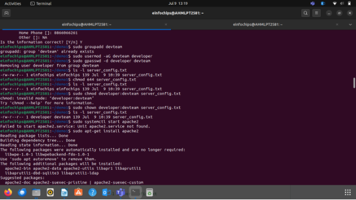

# Day 1: 
#### **Part 1: Creating and Editing Text Files**

#### **Part 2: User & Group Management** 

####
#### **Part 3: File Permissions Management** 

#### **Part 4: Controlling Services and Daemons** 
#### 
#### **Part 5: Process Handling** 
![ref1]

### **Creating and Deploying a Static Website with Apache2**
#### **Preparation**
- Ensure you have access to a Linux environment (e.g., virtual machines, EC2 instances, or local installations) with sudo privileges.
### **Activity Breakdown**
#### **Part 1: Installing Apache2** 
`	`**sudo apt-get update**

`	`**sudo apt install apache2**

#### **Part 2: Creating the Website**

#### **Part 3: Configuring Apache2 to Serve the Website**

**Final Output:**

