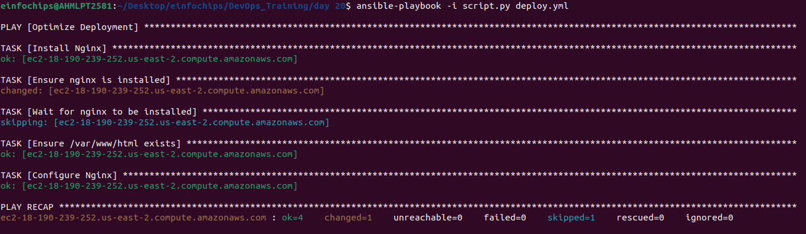
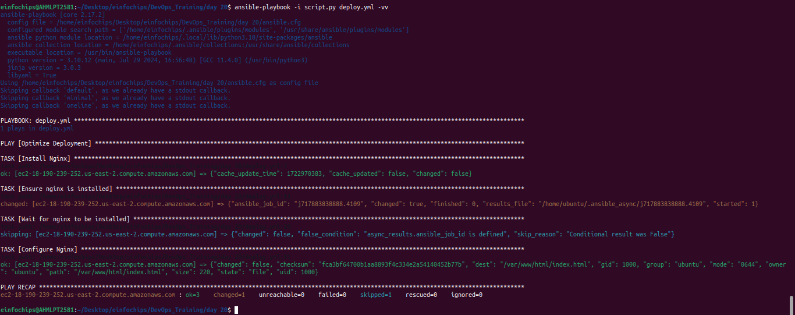
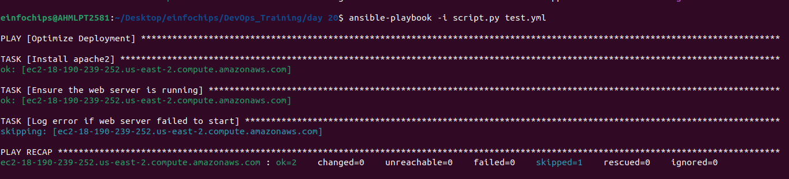
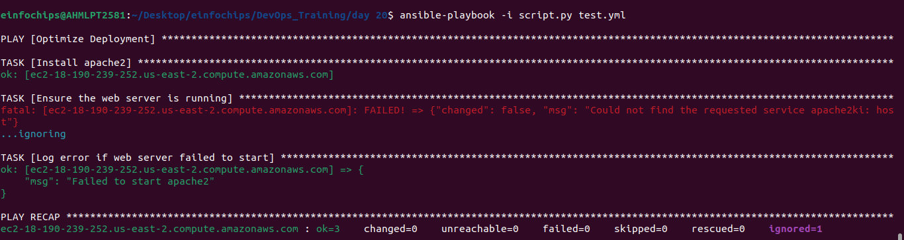
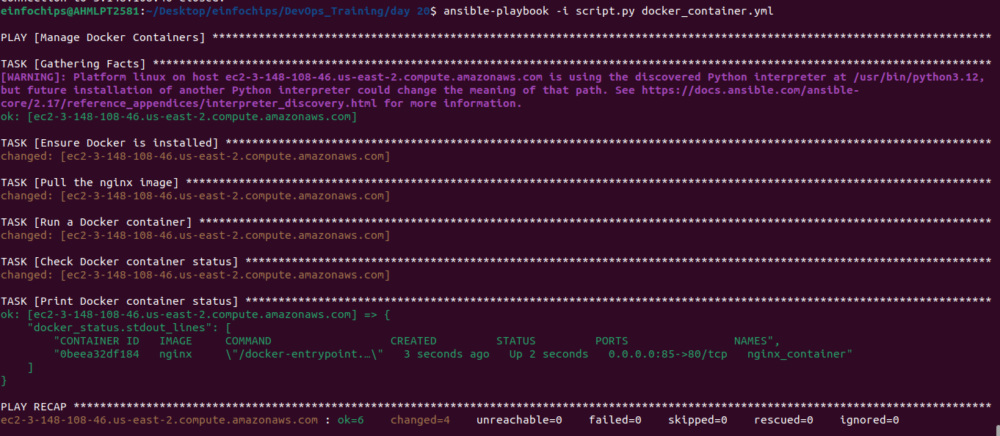

  # Ansible Project: Dynamic Inventory and Performance Optimization
#### **Project 01**

1. **Inventory Plugins**  
   * **Activity**: Configure a dynamic inventory plugin to manage a growing number of web servers dynamically. Integrate the plugin with Ansible to automatically detect and configure servers in various environments.  
   * **Deliverable**: Dynamic inventory configuration file or script, demonstrating the ability to automatically update the inventory based on real-time server data.  

      **Configuration File: `aws_ec2.yml`**

      ```yaml
      plugin: aws_ec2
      regions:
        - us-east-2
      filters:
        instance-state-name:
          - running
        tag:Name:
          - Utsav
      hostnames:
        - dns-name
      compose:
        ansible_host: public_dns_name
      ```


2. **Performance Tuning**  
   * **Activity**: Tune Ansible performance by adjusting settings such as parallel execution (forks), optimizing playbook tasks, and reducing playbook run time.  
   * **Deliverable**: Optimized `ansible.cfg` configuration file, performance benchmarks, and documentation detailing changes made for performance improvement.  

      **ansible.cfg**
      ```cfg
      [defaults]
      forks = 50
      gathering = smart
      fact_caching = jsonfile
      fact_caching_connection = /tmp/ansible_cache
      host_key_checking = False

      [ssh_connection]
      ssh_args = -o ControlMaster=auto -o ControlPersist=60s
      pipelining = True
      ```

    **Dynamic Inventory**
    - script.py
      ```py
      #!/usr/bin/env python3

      import json
      import boto3

      def get_inventory():
          ec2 = boto3.client('ec2', region_name='us-east-2')  # Specify your region
          response = ec2.describe_instances(Filters=[{'Name': 'tag:Name', 'Values': ['Utsav']}])
          
          inventory = {
              'all': {
                  'hosts': [],
                  'vars': {}
              },
              '_meta': {
                  'hostvars': {}
              }
          }
          
          ssh_key_file = '/home/einfochips/.ssh/ansible-worker.pem'  # Path to your SSH private key file
          ssh_user = 'ubuntu'  # SSH username
          
          for reservation in response['Reservations']:
              for instance in reservation['Instances']:
                  public_dns = instance.get('PublicDnsName', instance['InstanceId'])
                  inventory['all']['hosts'].append(public_dns)
                  inventory['_meta']['hostvars'][public_dns] = {
                      'ansible_host': instance.get('PublicIpAddress', instance['InstanceId']),
                      'ansible_ssh_private_key_file': ssh_key_file,
                      'ansible_user': ssh_user
                  }

          return inventory

      if __name__ == '__main__':
          print(json.dumps(get_inventory()))
      ```

    **deploy.yml**
    ```yml
    ---
    - name: Optimize Deployment
      hosts: all
      gather_facts: yes

      tasks:
        - name: Install Nginx 
          apt:
            name: nginx
            state: present
          become: yes

        - name: Ensure nginx is installed
          apt:
            name: nginx
            state: present
          async: 300
          poll: 0

        - name: Wait for nginx to be installed
          async_status:
            jid: "{{ item.ansible_job_id }}"
          register: async_results
          until: async_results.finished
          retries: 30
          delay: 10
          with_items:
            - "{{ ansible_job_ids }}"
          when: async_results.ansible_job_id is defined

        - name: Configure Nginx
          copy:
            src: index.html
            dest: /var/www/html/index.html
            owner: ubuntu
            group: ubuntu
            mode: '0644'
          notify: Restart nginx

      handlers:
        - name: Restart nginx
          service:
            name: nginx
            state: restarted
    ```

3. **Debugging and Troubleshooting Playbooks**  
   * **Activity**: Implement debugging strategies to identify and resolve issues in playbooks, including setting up verbose output and advanced error handling.  
   * **Deliverable**: Debugged playbooks with enhanced error handling and logging, including a troubleshooting guide with common issues and solutions.  

    Debugging :
    ```
    ansible-playbook -i script.py deploy.yml -vv
    ```
    Troubleshooting : 
    ```yml
    ---
    - name: Optimize Deployment
      hosts: all
      become: yes 
      tasks:
        - name: Install apache2 
          apt:
            name: apache2
            state: present
          become: yes

        - name: Ensure the web server is running
          service:
          name: apache2ki
          state: started
          register: result
          ignore_errors: yes

        - name: Log error if web server failed to start
          debug:
          msg: "Failed to start apache2"
          when: result is failed
      ```

4. **Exploring Advanced Modules**  
   * **Activity**: Use advanced Ansible modules such as `docker_container` to manage containerized applications and `aws_ec2` for AWS infrastructure management, demonstrating their integration and usage.  
   * **Deliverable**: Playbooks showcasing the deployment and management of Docker containers and AWS EC2 instances, along with documentation on the benefits and configurations of these advanced modules.

   docker_container.yml : 
   ```yml
    ---
    - name: Optimize Deployment
      hosts: all
      gather_facts: yes

      tasks:
        - name: Ensure nginx is installed
          apt:
            name: nginx
            state: present
          async: 300
          poll: 0

        - name: Wait for nginx to be installed
          async_status:
            jid: "{{ item.ansible_job_id }}"
          register: async_results
          until: async_results.finished
          retries: 30
          delay: 10
          with_items:
            - "{{ ansible_job_ids }}"
          when: async_results.ansible_job_id is defined

        - name: Check if my_var is defined
          debug:
            msg: "The value of my_var is {{ my_var }}"
          when: my_var is defined

        - name: Fail if my_var is not defined
          fail:
            msg: "my_var is not defined!"
          when: my_var is not defined
   ```

## **Output :**









