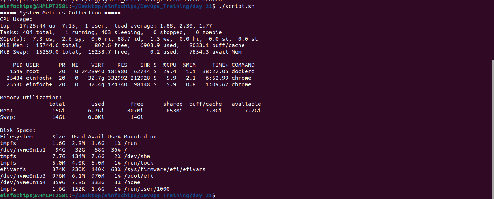
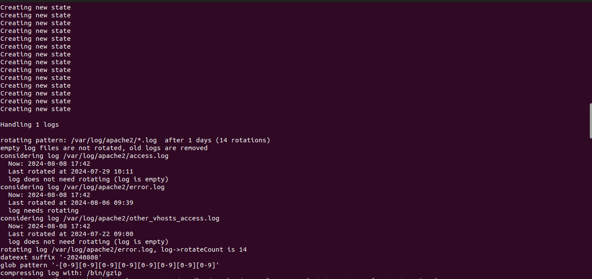
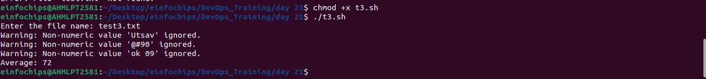
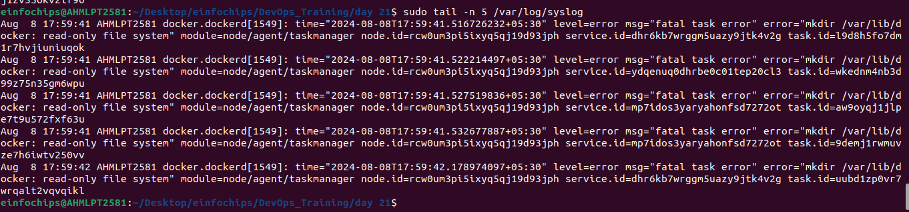
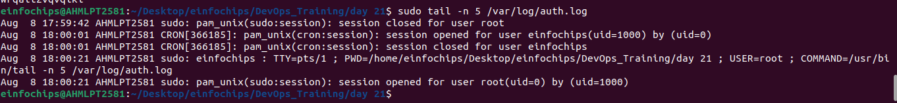
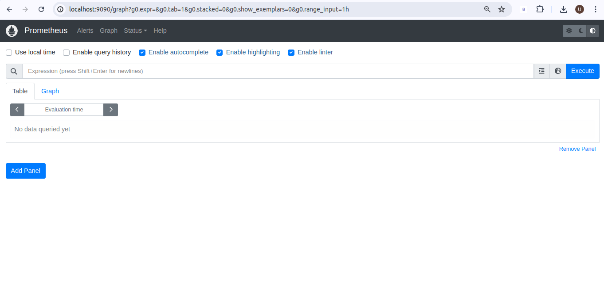
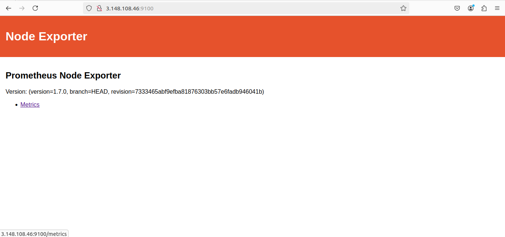
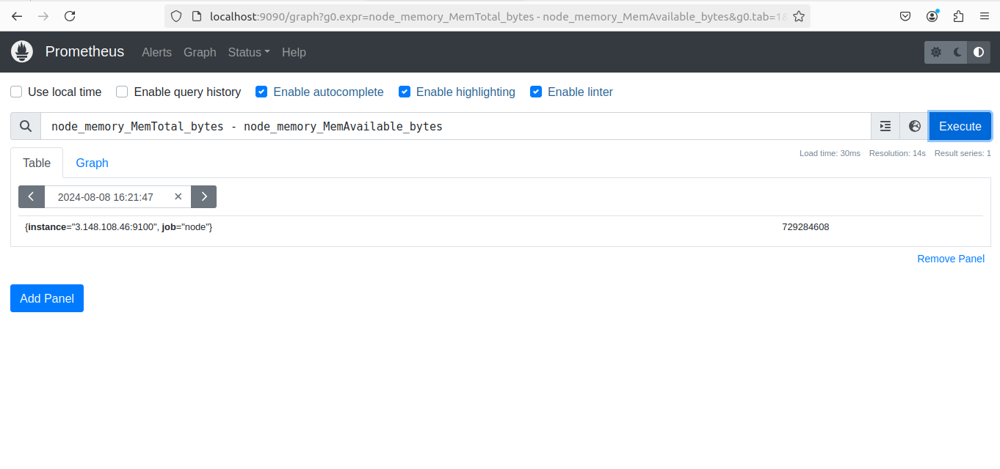
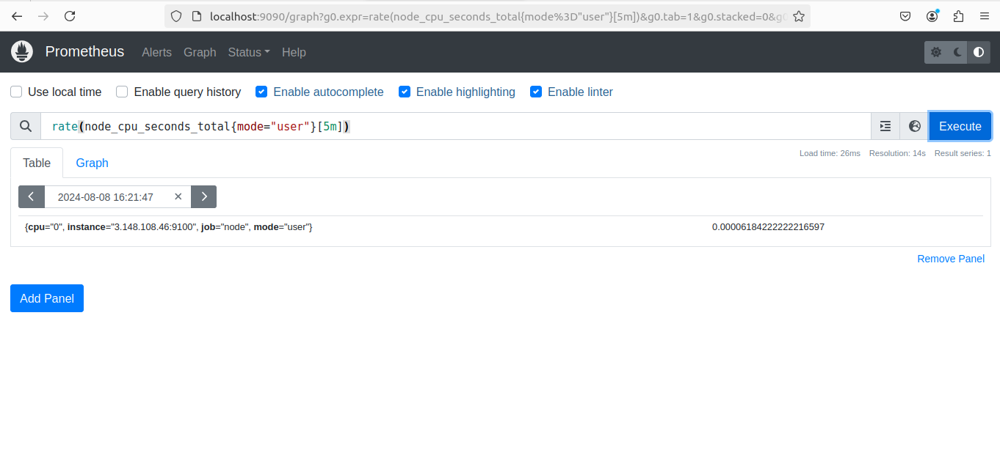
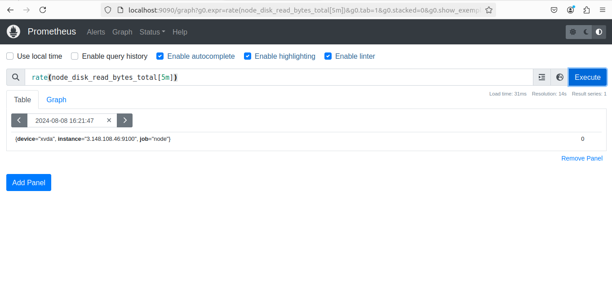

### **Project 01:** 

#### **Project Overview:**

The goal of this capstone project is to combine shell scripting with system monitoring and log management practices. You will create a set of automated tools using shell scripts to manage logs, monitor system performance using Prometheus and Node Exporter, and generate insights using PromQL queries. The project will require a systematic approach, covering scripting fundamentals, log management, and monitoring setup.

### **Project Deliverables:**

1. **Shell Scripts for Basic Operations:**  
   * **Task:** Write shell scripts to perform basic system operations, such as checking disk usage, memory usage, and CPU load.  
   * **Deliverable:**  
     * A collection of scripts that output system performance metrics.  
     * Scripts should include error handling and logging.  

    ### **script.sh**
    ```sh
    #!/bin/bash

    # Function to collect system metrics
    collect_system_metrics() {
        echo "===== System Metrics Collection ====="
        echo "CPU Usage:"
        top -b -n 1 | head -n 10  # Adjust as needed for your system
        echo ""
        echo "Memory Utilization:"
        free -h
        echo ""
        echo "Disk Space:"
        df -h
    }

    collect_system_metrics
    ```
    


2. **Log Management Script:**  
   * **Task:** Develop a script to automate log management tasks such as log rotation and archiving. This script should include the ability to compress old logs and delete logs older than a specified number of days.  
   * **Deliverable:**  
     * A shell script that performs log rotation based on predefined conditions (e.g., log size, log age).  
     * A report generated by the script detailing which logs were rotated, compressed, or deleted.  

        ```
        /var/log/apache2/*.log {
            daily
            missingok
            rotate 14
            compress
            delaycompress
            notifempty
            create 640 root adm
            sharedscripts
            prerotate
            if [ -d /etc/logrotate.d/httpd-prerotate ]; then
                run-parts /etc/logrotate.d/httpd-prerotate
            fi
            endscript
            postrotate
            if pgrep -f ^/usr/sbin/apache2 > /dev/null; then
                invoke-rc.d apache2 reload 2>&1 | logger -t apache2.logrotate
            fi
            endscript
        }
        ```
    - To check the log
        ```
        sudo logrotate -d /etc/logrotate.d/apache2
        ```
    


3. **Advanced Shell Scripting \- Loops, Conditions, Functions, and Error Handling:**  
   * **Task:** Refactor the previous scripts to include loops, conditionals, and functions for modularity. Implement error handling to manage potential issues during script execution.  
   * **Deliverable:**  
     * Modular shell scripts that use functions for repeatable tasks.  
     * Error-handling mechanisms in place for scenarios like missing files, insufficient permissions, etc.  
     * Logs that track script execution and any errors encountered.  

    ```sh
    #!/bin/bash

    # Function to calculate the average of numbers in a file
    calculate_average() {
        local file=$1
        local total=0
        local count=0

        while read -r line
        do
            if [[ $line =~ ^[0-9]+$ ]]; then
                total=$((total + line))
                count=$((count + 1))
            else
                echo "Warning: Non-numeric value '$line' ignored."
            fi
        done < "$file"

        if [ $count -eq 0 ]; then
            echo "Error: No valid numbers in the file."
            exit 1
        fi

        echo "Average: $((total / count))"
    }

    # Main script
    read -p "Enter the file name: " filename

    # Error handling for file existence
    if [ ! -f $filename ]; then
        echo "Error: File '$filename' not found!"
        exit 1
    fi

    # Call the function to calculate average
    calculate_average $filename
    ```

    test3.txt
    ```
    123
    88
    007
    Utsav
    @#90
    ok 09
    09887
    ```
    - To execute this file
        + chmod +x t3.sh
        + ./t3.sh
        + Enter file name :test3.txt
 
   


4. **Log Checking and Troubleshooting:**  
   * **Task:** Write a script that reads through system and application logs, identifies common issues (e.g., out of memory, failed service starts), and provides troubleshooting steps based on log analysis.  
   * **Deliverable:**  
     * A script that parses logs for errors or warnings and outputs possible root causes.  
     * Documentation on the types of logs checked and the issues identified.  
     * A troubleshooting guide based on common errors found in the logs.  

+ Troubleshooting Steps
    - Check System Logs for Errors:
    ```
    sudo tail -n 5 /var/log/syslog
    sudo tail -n 5 /var/log/auth.log
    ```

    

    

5. **Installation and Setup of Prometheus and Node Exporter:**  
   * **Task:** Install and configure Prometheus and Node Exporter on the system. Ensure that Node Exporter is properly configured to collect system metrics.  
   * **Deliverable:**  
     * A documented installation and configuration process for Prometheus and Node Exporter.  
     * A running instance of Prometheus scraping metrics from Node Exporter. 

    - Steps:
    1. apt-get update
    2. wget https://github.com/prometheus/prometheus/releases/download/v2.45.0/prometheus-2.45.0.linux-amd64.tar.gz
    3. tar xvf prometheus-2.45.0.linux-amd64.tar.gz
    4. cd prometheus-2.45.0.linux-amd64
    5. ./prometheus --config.file=prometheus.yml
    + localhost:9090 for prometheus
    

    + Add node exporter in Local
    
    1. wget https://github.com/prometheus/node_exporter/releases/download/v1.7.0/node_exporter-1.7.0.linux-amd64.tar.gz
    2. tar xvf node_exporter-1.7.0.linux-amd64.tar.gz
    3. cd node_exporter-1.7.0.linux-amd64
    4. ./node_exporter

    + localhost:9100 for node exporter
    

    + Add node to prometheus.yml
    ```yml
    - job_name: 'node'
      static_configs:
        - targets: ['3.148.***.**:9100']
    ```

6. **Prometheus Query Language (PromQL) Basic Queries:**  
   * **Task:** Create a series of PromQL queries to monitor system performance, such as CPU usage, memory usage, and disk I/O.  
   * **Deliverable:**  
     * A set of PromQL queries that can be used to monitor key system metrics.  
     * A dashboard setup guide or configuration that visualizes these metrics in Prometheus or Grafana.  

    1. node_memory_MemTotal_bytes - node_memory_MemAvailable_bytes

    

    2. rate(node_cpu_seconds_total{mode="user"}[5m])

    

    3. rate(node_disk_read_bytes_total[5m])

    

7. **Final Report and Presentation:**  
   * **Task:** Prepare a final report documenting all scripts, the installation and configuration of monitoring tools, and the output of your PromQL queries.  
   * **Deliverable:**  
     * A comprehensive project report covering all steps, scripts, and results.
