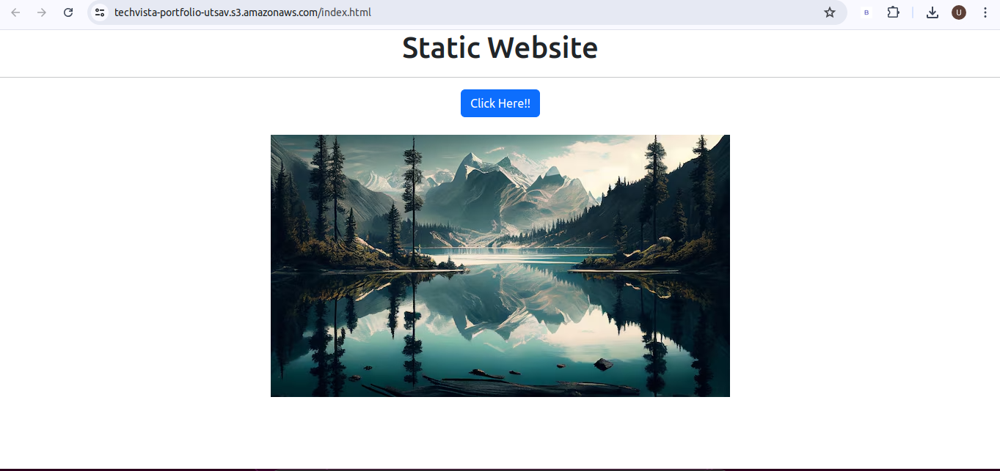
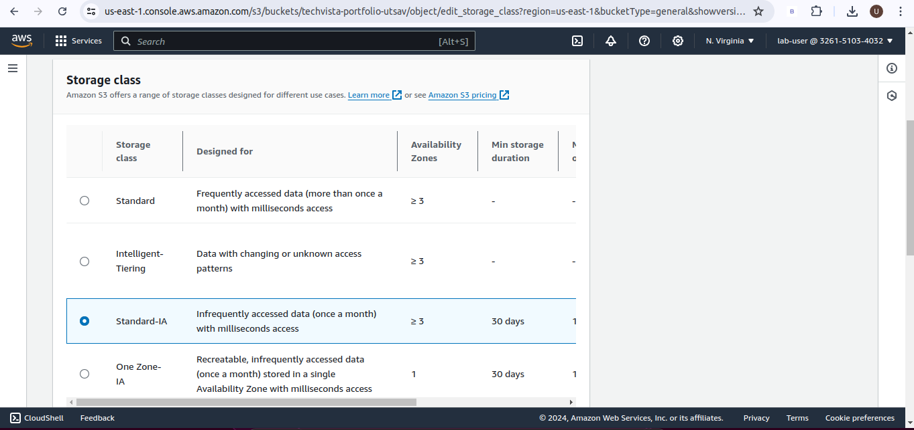
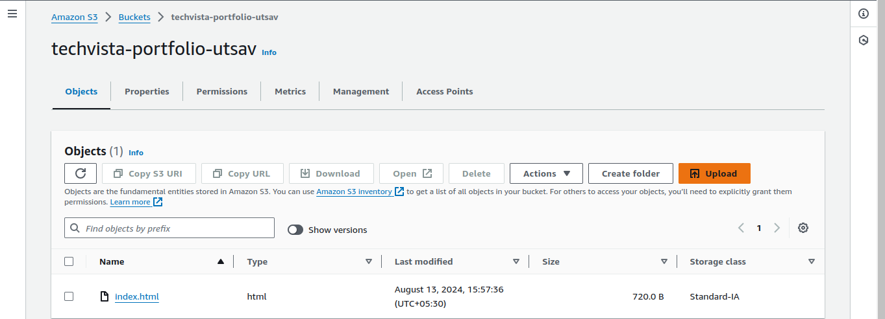
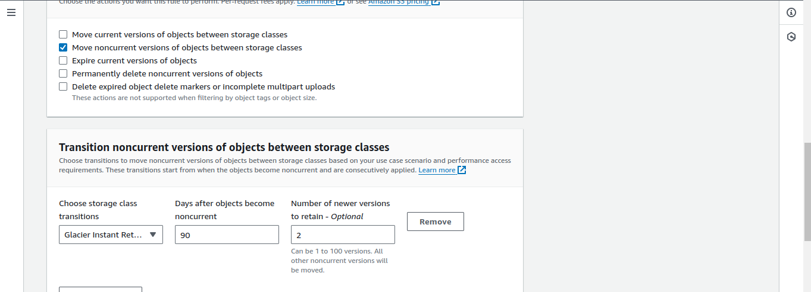
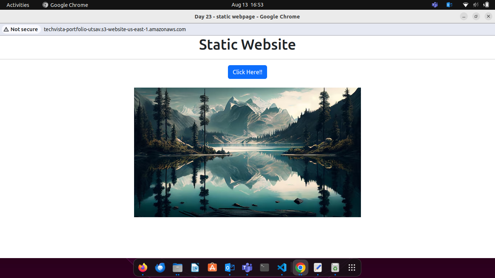

### **Comprehensive AWS S3 Management and Static Website Hosting**

#### **Objective:**

To test your knowledge and skills in managing AWS S3 storage classes, lifecycle management, bucket policies, access control lists (ACLs), and hosting a static website on S3. You will apply their understanding in a practical scenario, ensuring you have mastered the critical aspects of AWS S3.

#### **Project Scenario:**

You are tasked with creating and managing an S3 bucket for a fictional company, "TechVista Inc.," that hosts a static website for displaying their product portfolio. The website will have different types of content, including high-resolution images, which require careful storage management to optimize costs. Additionally, the company has strict security requirements for accessing the content.

#### **Project Steps and Deliverables:**

1. **Create and Configure an S3 Bucket:**  
   * Create an S3 bucket named `techvista-portfolio-[your-initials]`.  
   * Enable versioning on the bucket.  
   * Set up the bucket for static website hosting.  
   * Upload the provided static website files (HTML, CSS, images).  

    ```html
    <!DOCTYPE html>
    <html lang="en">
    <head>
        <meta charset="UTF-8">
        <meta name="viewport" content="width=device-width, initial-scale=1.0">
        <link href="https://cdn.jsdelivr.net/npm/bootstrap@5.3.3/dist/css/bootstrap.min.css" rel="stylesheet" integrity="sha384-QWTKZyjpPEjISv5WaRU9OFeRpok6YctnYmDr5pNlyT2bRjXh0JMhjY6hW+ALEwIH" crossorigin="anonymous">
        <title>Day 23 - static webpage</title>
    </head>
    <body>
        <center>
            <h1>Static Website</h1>
            <hr>
            <div class="btn btn-primary">Click Here!!</div>
            <br>
            <br>
            
        </center>
    </body>
    </html>
    ```
   * Ensure the website is accessible via the S3 website URL.  
    
    
2. **Implement S3 Storage Classes:**  
   * Classify the uploaded content into different S3 storage classes (e.g., Standard, Intelligent-Tiering, Glacier).  
    
    

   * Justify your choice of storage class for each type of content (e.g., HTML/CSS files vs. images).  
        + The storage class was changed from Standard to Standard-IA (Infrequent Access). This saves money by storing files that are rarely used but still need to be kept.

3. **Lifecycle Management:**  
   * Create a lifecycle policy that transitions older versions of objects to a more cost-effective storage class (e.g., Standard to Glacier).  
   * Set up a policy to delete non-current versions of objects after 90 days.  
    
        

4. **Configure Bucket Policies and ACLs:**  
   * Create and attach a bucket policy that allows read access to everyone for the static website content.  
   * Restrict access to the S3 management console for specific IAM users using the bucket policy.  
   * Set up an ACL to allow a specific external user access to only a particular folder within the bucket.  

    + In edit bucker policy
    + add statement
    ```
    {
    	"Version": "2012-10-17",
    	"Statement": [
    		{
    			"Sid": "Statement1",
    			"Principal": "*",
    			"Effect": "Allow",
    			"Action": "S3:GetObject"
    			"Resource": "your bucket ARN"
    		}
    	]
    }
    ```
        

5. **Test and Validate the Configuration:**  
   * Test the static website URL to ensure it is accessible.  

        

